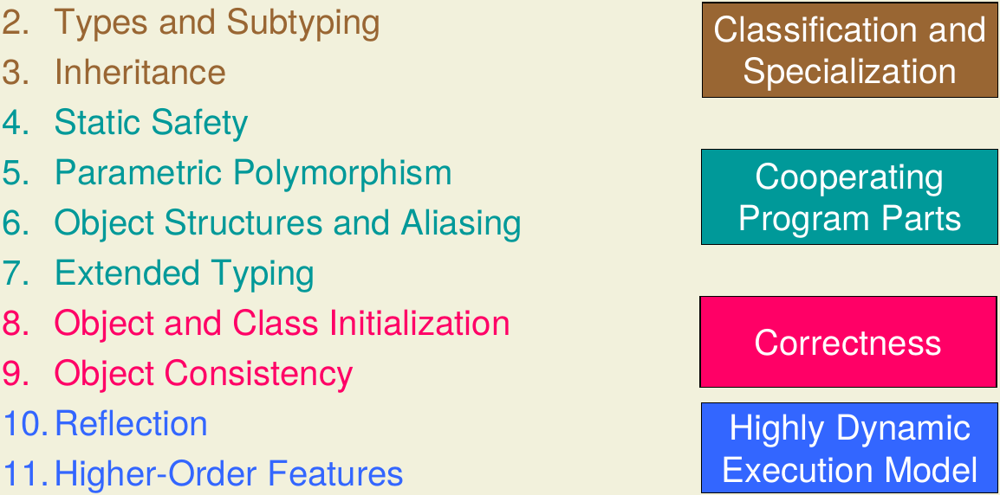
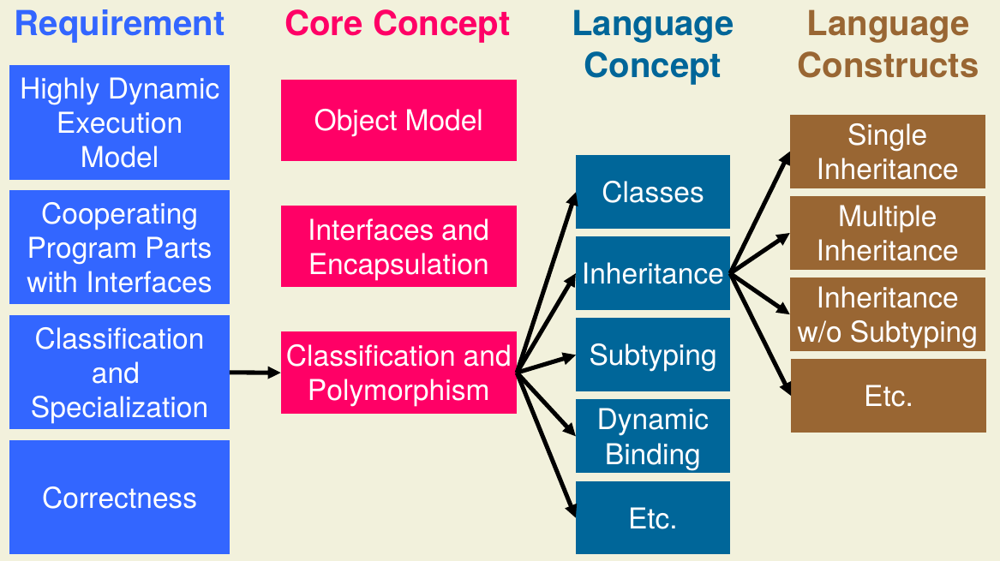

# Introduction

## Requirements

Requirements in SW technologies have changed drastically over the years. These days 4 basic approaches define
technologies:

- Reuse
- Computation & Simulation
- GUIs
- Distributed Programming

A starting example shown is written in C for a University Administration System (models Students, Professors &
Assistants). Has high levels of code repetition (i.e. copy-paste, duplications, high maintenance). No notion of objects.
Very clunky (but it works).

For an extension need to do 2 steps:

- Add Record and relevant function
- Reuse code for repository

Requirements turn into concepts:

- Cooperating program parts with well defined interfaces
- Classification and specialization of program parts
- Dynamic adaptation of program behavior
- Correct Programs

{ width=75% }

## Core Concepts

### Object Model
Software system with a set of cooperating objects (which hold state and processing abilities, e.g. exchanging messages).

Objects have:

- State
- Identity (Variant 1: Copy; Variant 2: Share)
- Lifecycle
- Location
- Behavior

Programming paradigms differentiate themselves substantially between imperative and object oriented programming
structures and execution models.

### Interfaces and Encapsulation
Objects have well defined interfaces for field and methods (publicly accessible and hidden). Interfaces also hide the
implementation (encapsulation & information hiding). These interfaces define program behavior.

### Classification and Polymorphism
Classification: Hierarchical structuring of objects (belong to different classes simultaneously).

Substitution Principle: Subtype objects can be ued wherever supertype objects are expected.

Arrows in diagrams represent “is-a” relation. Source of arrow is subclass, point is superclass.

A program part is polymorphic if it can be used for objects of several classes.

Subtype polymorphism:

- Direct consequence of substitution principle
- Program parts working with supertype objects work as well with subtype objects

Alternative types (not core concept): Parametric polymorphism (generic types) & ad-hoc polymorphism (method overloading)

Parametric polymorphism:

- Uses type parameters
- Implementation can be used for different types
- Type mismatches detectable at compile time

Ad-Hoc polymorphism:

- Several methods with same name but different arguments
- Aka overloading
- Can be modeled by renaming methods easily

### Specialization
Definition: Adding specific properties to an object or refining a concept by adding further characteristics

Requirement: Behavior of specialized objects is compliant to behavior of more general objects –> Parts working for
general objects work as well for specialized objects!

Specialization results in inheritance of fields and methods. Methods can be overridden in subclasses!

## Language Concepts

Dynamic Method Binding: Uses classification/polymorphism where subclass objects are specialized and dynamic binding
selects at runtime the correct method depending on type of receiver object.

Case Study: Trying OO in C

Pros:

- Can express objects, fields, methods, constructors and dynamic method binding
- Imitating OO programming the union in Person & switch dispensable
- Behavior of reused code can be adapted without changing implementation

Cons:

- Inheritance has to be replaced by code duplication
- Subtyping simulated (additional requirements need being fulfilled)
    - Typesafe casts
    - Memory layout needs to stay constant between super- and subclasses
- Language support needed to apply OO concepts

Alternative: Java solution

Uses:

- Inheritance (avoids code duplication)
- Subtyping (express classification)
- Overriding (specialize methods)
- Dynamic Binding (adapt reused algorithms)

{ width=75% }

## Course Outline

## Language Design

Used by many? No!

Making productive programmers? No!

Good language resolves design trade-offs suitable for its application domain

### Simplicity
Syntax and semantics easily understood by users and implementers of language

Not small number of constructs!

Simple languages: BASIC, Pascal, C

### Expressiveness
Express complex processes and structures

Conflicts with simplicity!

Expressive languages: C#, Scala, Python

### (Static) Safety
Discourages errors and allows errors to be discovered and reported at compile-/runtime.

Conflicts with expressiveness and performance!

Safe languages: Java, C#, Scala

### Modularity
Allows modules to be compiled separately

Conflicts with expressiveness and performance!

Modular languages: Java, C#, Scala

### Performance
Programs can be executed efficiently

Conflicts with safety, productivity and simplicity!

Efficient Languages: C, C++, Fortran

### Productivity
Low cost of writing programs

Related to expressiveness

Conflicts with static safety!

Productive Languages: Visual Basic, Python

### Backwards Compatibility
Newer versions work and interface with programs in older versions

Conflict with simplicity, performance and expressiveness!

Backwards compatible languages: Java, C
