# Types and Subtyping

Safe languages detect situations where receiver object does not have accessed field/method.

Type systems can detect such errors.

Security Model: Access control via API. Code must be prevented from by-passing API.

## Types

### Type Systems
Definition: A Type System is a tractable syntactic behavior for proving absence
of certain program behaviors by classifying phrases according to the kinds of
values they compute.

Syntactic: Rules based on form, not behavior

Phrases: Expressions, methods, ...

Kinds of values: Types

Untyped languages:

- No classification of values into types
- Ex: assembly

Weakly-typed languages:

- Classify values into types, not strictly enforce additional restrictions
- Ex: C, C++

Strongly-typed languages:

- Enforce all operations applied to arguments of appropriate types
- Ex: C#, Eiffel, Java, Python, Scala, Smalltalk

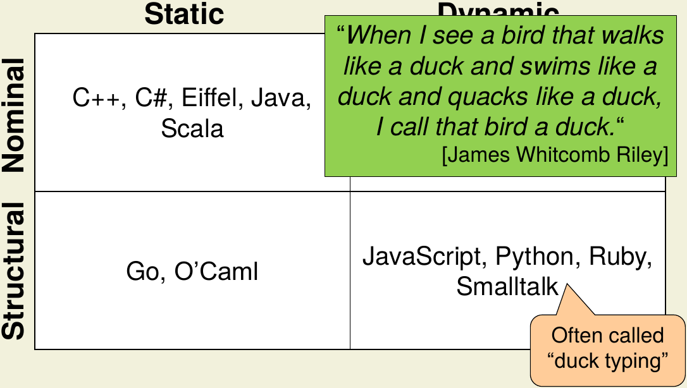{ width=75% }

### Types
Definition: A type is a set of values sharing some properties. A value v has type T if v is an element of T.

Nominal Types:

- Based on type names
- Ex: C++, Eiffel, Java, Scala

Structural Types:

- Based on availability of methods/fields
- Ex: Python, Ruby, Smalltalk, Go, O'Caml

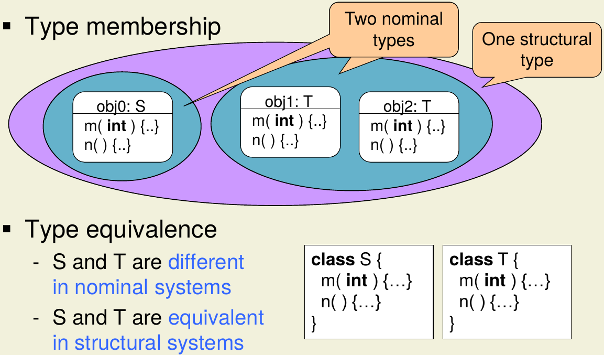{ width=75% }

### Static Type Checking
Each expression of program has a type. Types of variables and methods declared explicitly or inferred. Types of
expression derivable from types of constituents. Type rules used at compile time to check whether program correctly
typed.

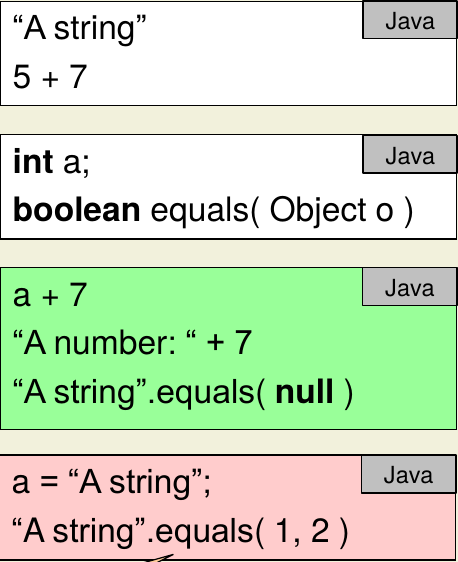{ width=30% }

#### Bypassing
Some languages allow this. Useful to interoperate with dynamically-typed languages or HTML DOM. Type safety preserved
via tun-time checks.

### Dynamic Type Checking
Variables, methods, expressions of program typically not typed. Every objects and value has type. Run-time system checks
operations applied to expected arguments.

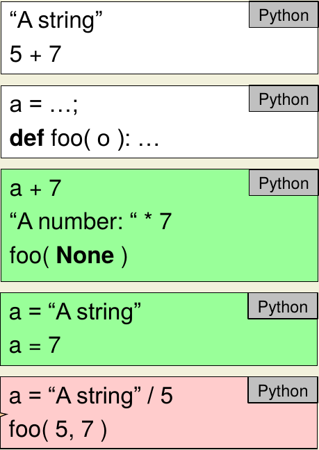{ width=30% }

### Static Type Safety
Definition: A programming language is called type-safe if its design prevents type errors.

Statically type-safe OO languages guarantee following type invariant: In every execution state the type of the value
held by variable v is a subtype of the declared type of v.

Type-safety guarantees the absence of certain run-time errors.

#### Run-Time Checks
Most static types rely on dynamic checks for certain operations. Common examples: type conversion by casts

Run-time checks throw an exception in case of a type error.

### Dynamic Type Systems

#### Expressiveness
Static checkers need to approximate run-time behavior (conservative checks). --> Python

Dynamic checkers support on-the-fly code generation and dynamic class loading. --> JavaScript

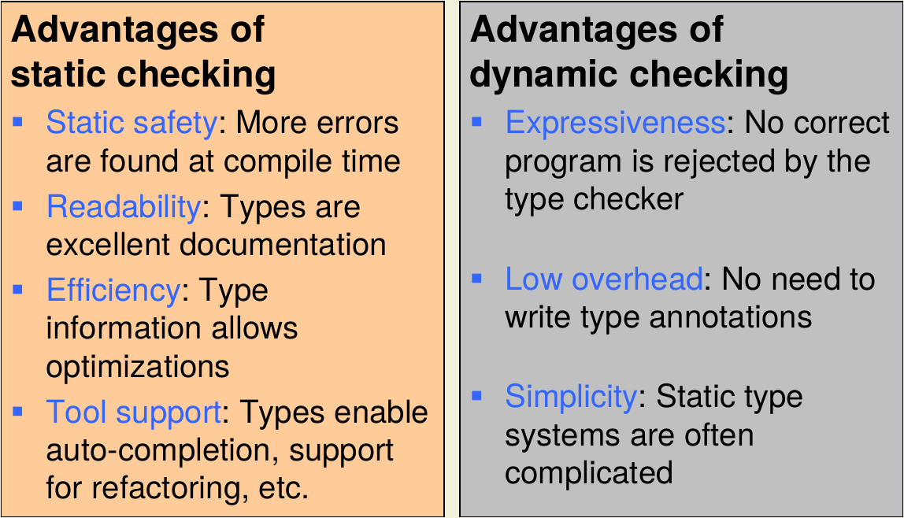{ width=75% }

## Subtyping

Substitution principle: Objects of subtypes can be used wherever objects of supertypes are expected.

Syntactic classification: Subtypes can understand at least the messages of their supertypes.

Semantic classification: Subtypes can provide at least the behavior of their supertypes.

The subtype relation corresponds to the subset relation on the values of a type.

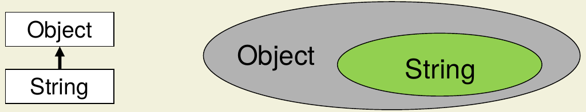{ width=75% }

### Nominal Type Systems

- Type membership based on type names
- Determine subtype relations based on explicit declarations

Subtypes follow substitution principle for:

- Method calls
- Field accesses

Subtype objects have **wider interfaces** than supertype objects:

- Existence of methods/fields
- Accessibility of methods/fields
- Types of methods/fields

#### Existence
Subtypes may add but not remove methods/fields as otherwise substitution principle violated!

#### Accesibility
An overriding method must not be less accessible than the method it overrides!

Ex: subtype uses *private*, supertype uses *public*)

#### Overriding
##### Parameter Types
**Contravariant Parameters:** An overriding method **must not require __more specific__** parameter types than the method it overrides.

Ex: Subtype's argument is *String*, Supertype's is *Object*

##### Result Types
**Covariant Results:** An overriding method **must not have __more general__** result types than the method it overrides.

Ex: Subtype returns *Object*, Supertype returns *String*

##### Fields
Subtypes **must not change** the types of fields (bound statically!).

Field as pair of setter/getter:

- Specializing field type (S <: T) --> specializes argument of setter --> violates contravariant parameters
- Gneralizing field type (T <: S) --> generalizes result of getter --> violates covariant results

##### Immutable Fields
Types of immutable fields **can be specialized** in subclasses (S <: T) as fields not allowed to have setters --> contravariance not applicable! This **only works** if supertype not initializes field for subtype objects.

Esoteric extension, literally no mainstream language allows this.

#### Narrowing Interfaces (Eiffel)
Permits "illegal" narrowing of interfaces:

- Changing existence of methods
- Overriding with covariant parameter types
- Specializing field types

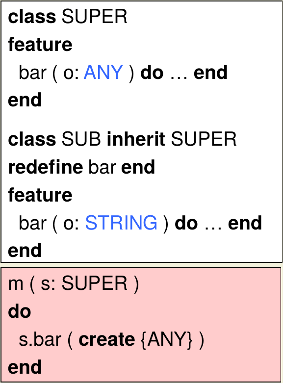{ width=30% }

Covariant overriding on attached types (non-null) requires detachable type (possibly null). Runtime system passes null when argument not of expected type --> Method must check for null!

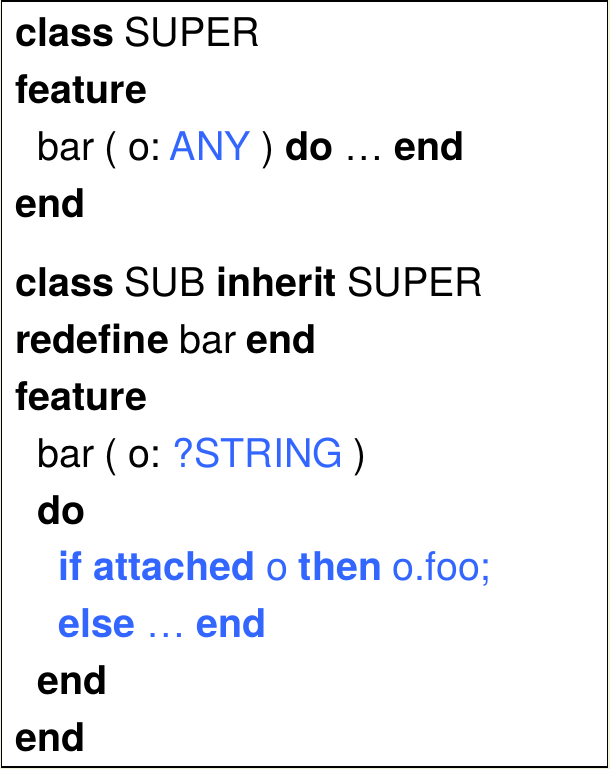{ width=30% }

#### Covariant Arrays
In Java & C# arrays covariant --> If \texttt{S <: T}, then \texttt{S[] <: T[]}

--> Array updates require runtime type-checks!

Covariance allows writing methods which work for all arrays as result type is more specific!

Trade-Off between expressiveness and static safety (expressiveness won; Generics the better solution as no trade-off).

#### Shortcomings
Can impede reuse (cannot reuse existing classes to store objects in collection
of superclass when neither is a subtype of a superclass).

Can limit generality (many method signatures overly restrictive).

#### Reuse
##### Adapter Pattern
Implement Adapter (wrapper) which holds not only subtype but also delegates calls to it.

Cons:

- Boilerplate code
- Overhead (Runtime and Memory)

Pros:

- Works also if "interface" is reused.

##### Generalization
Most OO-langs support specialization of superclasses. Select few also support generalization (bottom-up development) -->
Implement subtypes first, then can work on supertype.

Doesn't match well with inheritance.

Issues (subclass already has superclass):

- Single inheritance: Exchanging superclass might affect subclass
- Multiple inheritance: Additional superclass may cause conflicts

#### Generality
##### Additional Supertypes
Weaker type requirements by declaring interfaces for useful supertypes.

But the more interfaces there are, the more boilerplate code there is. Also the granularity of each interface is not
generally decidable.

##### Optional Methods
Implementation is allowed to throw unchecked exceptions (Java). For \texttt{Collection} this extends to all mutating methods.

--> Loss of static safety

### Structural Type System

- Determine type membership and subtype relations based on availability of methods and fields

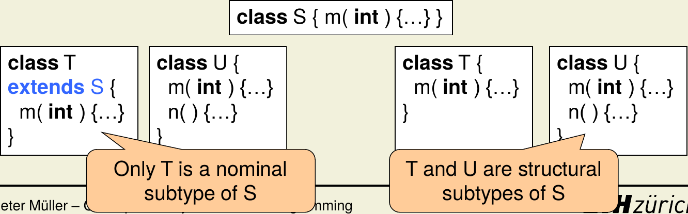{ width=75% }

#### Subtyping
Subtypes can understand at least the messages of supertypes (--> By definition **wider interface**):

- Method calls
- Field accesses

#### Reuse
All types automatically subtypes of types with smaller interfaces --> No extra code needed!

Don't support inheritance (like generalizaton)

An interface can easily be turned into a supertype for subtypes (i.e. subtypes implement all methods).

#### Generality
Static type checking:

- Additional supertypes approach applies
- Additional supertypes must only be declared, but not subtype relation

Dynamic type checking:

- Arguments to ops not restricted
- Possible runtime errors (similar to optional-methods approach)

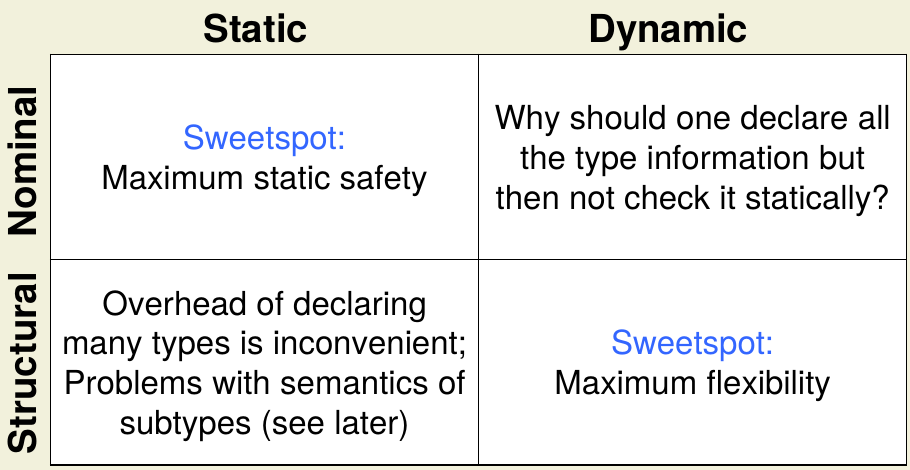{ width=75% }

## Behavioral Subtyping

### Types
What are the "properties" shared by the values of a type? In our context "properties" should also include the behavior
of the object --> Syntax plus contracts (interface specifications)

#### Method Behavior
Preconditions(\texttt{requires}): Must hold before the method body is executed.

Postconditions(\texttt{ensures}): Must hold in the state after the method body has terminated.

Old-expression(\texttt{old()}): Refers to prestate values from the postconditions.

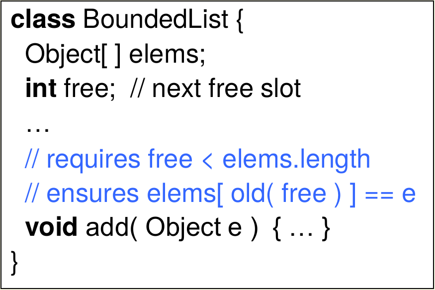{ width=40% }

#### Object Invariants
Describe consistency criteria for objects.

Invariants(\texttt{invariant}): Must hold in all states in which object can be accessed by others.

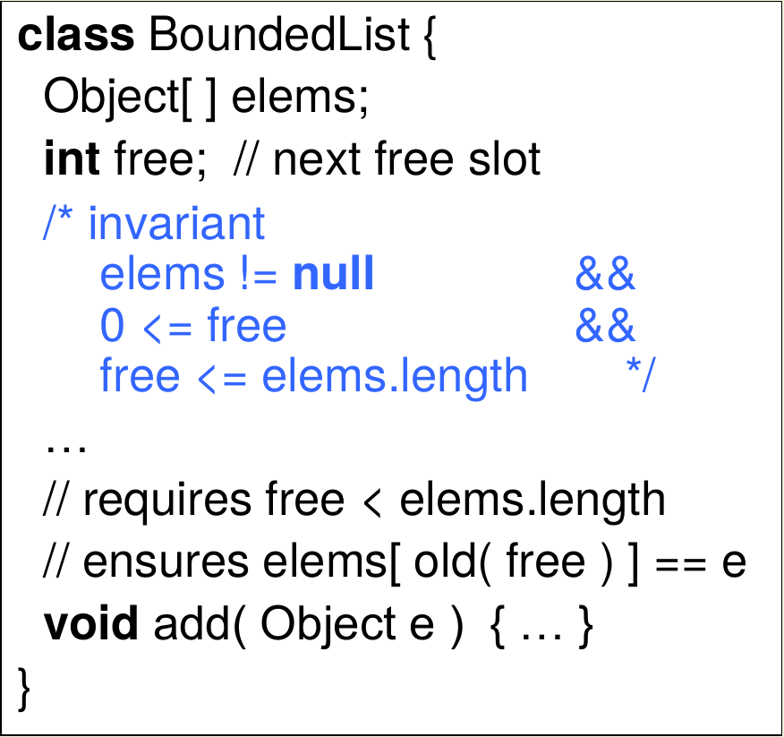{ width=40% }

#### Visible States
Invariants must hold in pre- and poststates (aka visible states) of method executions but may be violated temporarily in between.

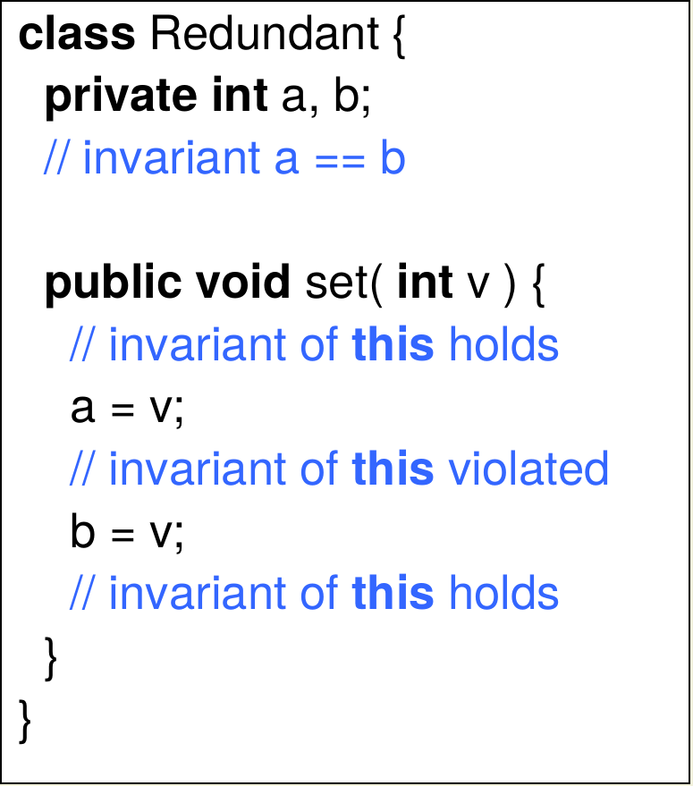{ width=40% }

#### History Constraints
Describe how objects evolve over time, relating to visible states. Constraints must be reflexive and transitive.

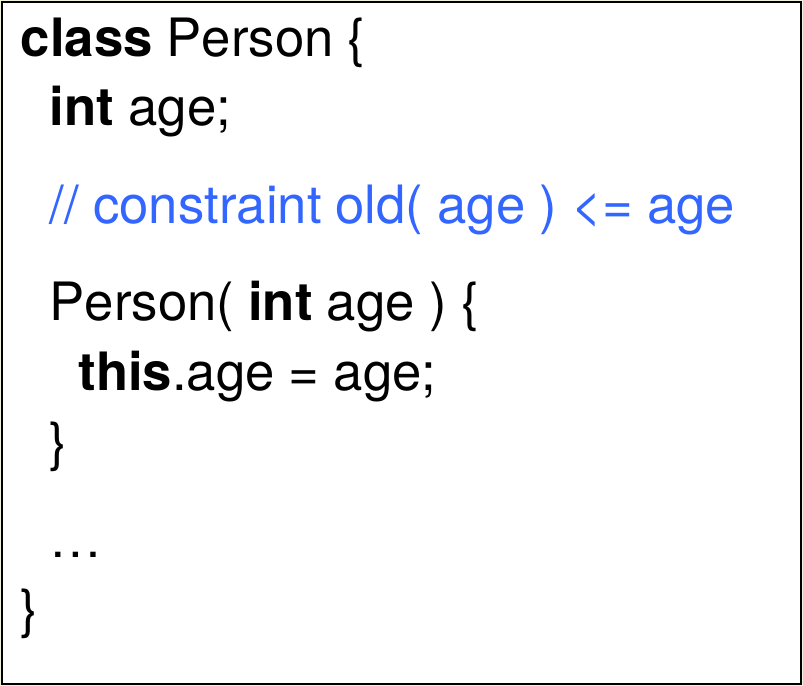{ width=40% }

#### Static vs. Dynamic Contract Checking
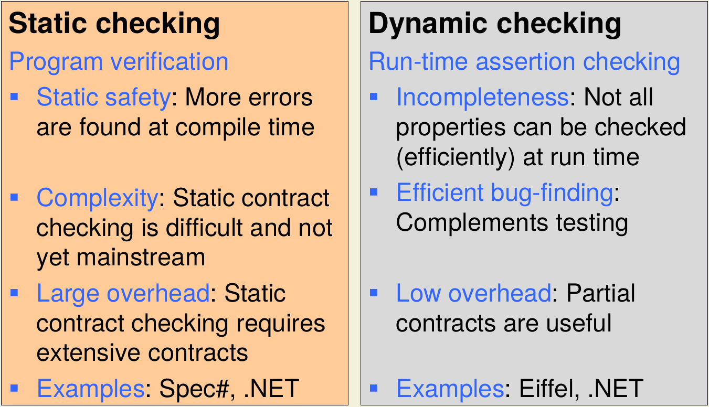{ width=75% }

#### Contracts and Subtyping
Subtypes specializes the behavior of supertypes.

##### Preconditions
Overriding methods of subtypes may have **weaker preconditions** than corresponding supertype methods.
Goes towards \texttt{true}.

##### Postconditions
Overriding methods of subtypes may have **stronger postconditions** than corresponding supertype methods.
Goes towards \texttt{false}.

##### Invariants
Subtypes may have **stronger invariants**.

##### History Constraints
Subtypes may have **stronger history constraints**.

##### Static Checking of Behavioral Subtyping
For each override \texttt{S.m} of \texttt{T.m} (with \texttt{S <: T}) check for all parameters, heaps and results:

- Pre\textsubscript{\texttt{T.m}} => Pre\textsubscript{\texttt{S.m}}: Precondition of superclass implies precondition of
subclass
- Post\textsubscript{\texttt{S.m}} => Post\textsubscript{\texttt{T.m}}: Postcondition of subclass implies postcondition of
superclass

Any caller wanting to use postcondition must establish precondition:

old(Pre\textsubscript{\texttt{T.m}}) => (Post\textsubscript{\texttt{S.m}} => Post\textsubscript{\texttt{T.m}})

This means the old precondition of the superclass being true implies that the postcondition of the subclass being true
enforces the postcondition of the superclass to be valid.

Additionally need to check on all heaps for \texttt{S <: T}:

- Inv\textsubscript{\texttt{S}} => Inv\textsubscript{\texttt{T}}
- Cons\textsubscript{\texttt{S}} => Cons\textsubscript{\texttt{T}}

**Important:** Entailment not decidable!

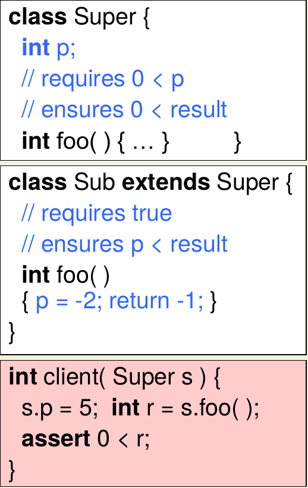{ width=40% }
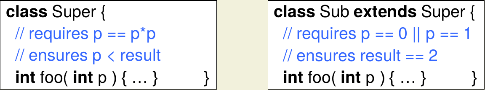{ width=60% }

#### Specification Inheritance
Behavioral subtyping enforceable by inheriting specification from supertypes.

Rule for invariants:

- Invariant of a type \texttt{S} is **conjunction** of Inv\textsubscript{\texttt{S}} and invariants declared in the supertypes of \texttt{S}.
- Subtypes have **stronger** invariants

Rule for history constraints:

- Same as for invariants

#### Inheritance of Method Contracts
Overriding Method **must not declare __additional preconditions__** --> both methods have identical preconditions

Postcondition of overriding method is **conjuction** of postcondition declared for that method and postconditions
declared for methods it overrides. --> overriding methods have **stronger postconditions**

#### Precondition Inheritance
##### Shortcomings
Not applicable for multiple subtyping! Also disallows **precondition weakening**.

##### Improved Rule
Clients view object through static type (static type's pre/post can be narrowed) --> Implementation may assume only disjunction of all inherited and declared
preconditions

##### Effective Preconditions
Overriding methods have **weaker effective preconditions**.
Notation:

- Pre\textsubscript{\texttt{T.m}} is precondition of method \texttt{m} declared in class \texttt{T}
- PreEff\textsubscript{\texttt{S.m}} is the effective precondition of a method \texttt{m} in class \texttt{S}. It is the **disjunction**
  (i.e. logical \texttt{OR}) of the precondition Pre\textsubscript{\texttt{S.m}} declared for the method and the preconditions
  Pre\textsubscript{\texttt{T.m}} declared for the methods it overrides.

PreEff\textsubscript{\texttt{S.m}} = Pre\textsubscript{\texttt{S.m}} || Pre\textsubscript{\texttt{T.m}} || Pre\textsubscript{\texttt{ T'.m }} || ...

###### Shortcomings
Works for multiple subtyping. Allows **precondition weakening**.

#### Postcondition Inheritance
##### Improved Rule
Becomes too restrictive! --> Idea: Implementation needs to satisfy each postcondition for which the corresponding
precondition holds!

PostEff\textsubscript{\texttt{S.m}} = (Pre\textsubscript{\texttt{S.m}} => Post\textsubscript{\texttt{S.m}}) && (Pre\textsubscript{\texttt{T.m}} =>
Post\textsubscript{\texttt{T.m}}) ...

**BUT** This results in bogus results --> Idea: Evaluate precondition in prestate!

PostEff\textsubscript{\texttt{S.m}} = (old(Pre\textsubscript{\texttt{S.m}}) => Post\textsubscript{\texttt{S.m}}) &&
(old(Pre\textsubscript{\texttt{T.m}}) => Post\textsubscript{\texttt{T.m}}) ...

##### Effective Postconditions
Overriding methods have **stronger effective postconditions**.
Notation:

- Post\textsubscript{\texttt{T.m}} is postcondition of method \texttt{m} declared in class \texttt{T}
- PostEff\textsubscript{\texttt{S.m}} is the effective postcondition of a method \texttt{m} in class \texttt{S}. It is 
  the **conjunction** (i.e. logical \texttt{AND}) of the implications (old(Pre\textsubscript{\texttt{T.m}}) =>
  Post\textsubscript{\texttt{T.m}}) for all types \texttt{T} such that \texttt{T} declares \texttt{S.m} or \texttt{S.m}
  overrides \texttt{T.m}

PostEff\textsubscript{\texttt{S.m}} = (old(Pre\textsubscript{\texttt{S.m}}) => Post\textsubscript{\texttt{S.m}}) &&
(old(Pre\textsubscript{\texttt{T.m}}) => Post\textsubscript{\texttt{T.m}}) &&
(old(Pre\textsubscript{\texttt{T'.m}}) =>  Post\textsubscript{\texttt{T'.m}}) && ...

### Runtime Checking
Checking entailment for all arguments, heaps and results impossible at run time. Specification inheritance avoids this
problem with effective contracts (satisfy behavioral subtyping) which can be checked at runtime.

### Behavioral Structural Subtyping
Dynamic type checking --> callers no static knowledge of contracts

- Cannot establish preconditions
- Postconditions effectively true

Called method may check own contract at runtime

- Precondition failures analogous to "message not understood" --> Caller **cannot** be blamed
- Postcondition failures may reveal error in method implementation (e.g. assert) --> Callee **cannot** be blamed

Static structurcal type checking --> callers can state which signature and behavior required
--> Contract statically or dynamically checkable.

Behavioral Subtyping needs checking if type system determines subtype relation:

- Statically possible but generally not automatic.
- Dynamic checking impossible
    - Same reasons as above with called method checking own contract at runtime

### Types as Contracts
Types special form of contract (where static checking decidable!)

Operator \texttt{type(x)} yields type of object stored in \texttt{x} (dynamic type of \texttt{x} specifically).

#### Subtyping
Stronger invariant: \texttt{type(}p\texttt{) <: S' => type(}p\texttt{) <: S} requires \texttt{S' <: S} --> Covariance!

Weaker precondition: \texttt{type(}q\texttt{) <: T => type(}q\texttt{) <: T'} requires \texttt{T <: T'} -->
Contravariance!

Stronger postcondition: \texttt{type(}result\texttt{) <: U' => type(}result\texttt{) <: U} requires \texttt{U' <: U} -->
Covariance!

### Invariants over Inherited Fields
Can be violated by all methods that have access to inherited field!

Static checking not modular!

Even without qualified field accesses (\texttt{x.f = e}) requirement to re-check all inherited methods!

### Immutable Types
Objects of immutable types don't change state after construction!

Pro:

- No unexpected modifications possible of shared
- Thread synchronization irrelevant
- Only consistent states

Ex (Java):

- String
- Integer

Subtype relation between mutable and immutable?

Proposal 1: Immutable type should be subtype
Impossible! Mutable type has wider interface!

Proposal 2: Mutable type should be subtype
Mutable type has wider interface (also complies with structucal subtyping!)
**BUT** Mutable type does not specialize behavior!

Clean solution:

- No subtype relation!
- Only exception: \texttt{Object} w/o history constraint

Java solution: Immutable types are subtypes of mutable types

- AbstractCollection & Iterator mutable
- Mutating Methods are **optional**
